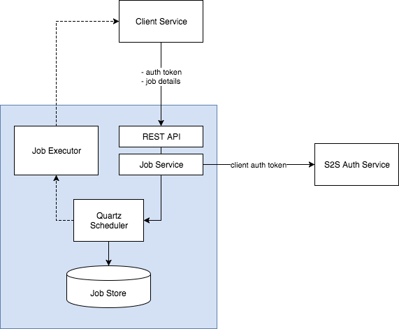

# Job Scheduler
[](https://travis-ci.org/hmcts/job-scheduler)
[](https://www.codacy.com/app/HMCTS/job-scheduler)
[](https://www.codacy.com/app/HMCTS/job-scheduler)

The job scheduler micro service allows other services to schedule http actions in the future. For example, scheduler
can send a POST request to a specified url every Sunday at 2am.



## Getting started

### Prerequisites
- [JDK 8](https://java.com)

### External service dependencies

In order to validate service auth tokens, Job Scheduler sends http requests to S2S Service.  
URL to S2S can be configured via the config file or using environment variables.  
S2S Service is currently not open source.

### Running
Run the application by executing:
```bash
./gradlew bootRun
```

In order to run the application (with its database) in Docker, execute:
```bash
./bin/run-in-docker.sh
```

For more information:

```bash
./bin/run-in-docker.sh -h
```

Script includes bare minimum environment variables necessary to start database and api instances. Whenever any variable is changed or any other script regarding docker image/container build, the suggested way to ensure all is cleaned up properly is by this command:

```bash
docker-compose rm
```

It clears stopped containers correctly. Might consider removing clutter of images too, especially the ones fiddled with:

```bash
docker images

docker image rm <image-id>
```

There is no need to remove postgres and java images.

## API documentation
Api documentation is provided with Swagger:
- json spec: [http://localhost:8484/v2/api-docs](http://localhost:8484/v2/api-docs)
- swagger UI: [http://localhost:8484/swagger-ui.html](http://localhost:8484/swagger-ui.html)

## Developing

### Unit tests
To run all unit tests execute the following command:
```bash
./gradlew test
```

### Code quality checks
We use [checkstyle](http://checkstyle.sourceforge.net/) and [PMD](https://pmd.github.io/).  
To run all checks execute the following command:
```bash
./gradlew check
```

## Job management

The service manages its clients' jobs with [Quartz](http://www.quartz-scheduler.org/).  
It uses a PostgreSQL database for persisting those jobs. Also, Quartz is configured
to run in cluster mode, i.e. the load will be distributed among multiple nodes, each
running different jobs.

## Data security

As of now, job information is stored in an unencrypted form. This means that clients
of this service must not include any sensitive information (tokens, passwords, personally
identifiable information, etc.) in their requests.

## License
This project is licensed under the MIT License - see the [LICENSE](LICENSE) file for details.
